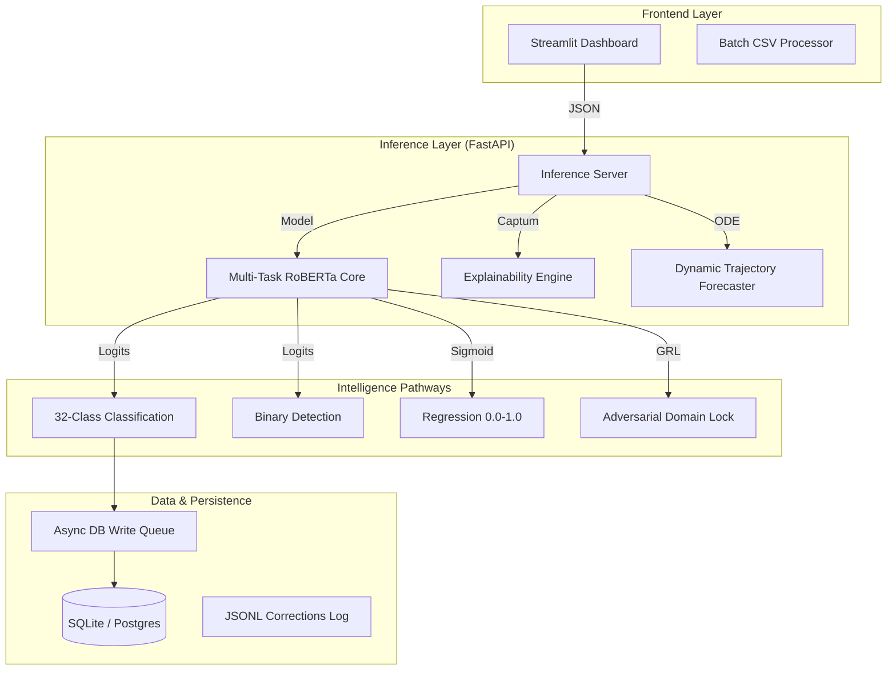

# 🎭 Plutchik Emotion Engine (Hardened Production Suite)

## 🌌 Overview: Beyond Sentiment Analysis

The **Plutchik Emotion Engine** is a high-fidelity, multi-task neural framework designed to decode the "Emotional DNA" of human conversation. Unlike traditional sentiment analysis which reduces human experience to a binary (Positive/Negative) or ternary (Neutral) scale, the Plutchik Engine operates on a **32-class emotional taxonomy** derived from Robert Plutchik's psychophysiological theory.

It is built to handle the complexities of **Emotion Recognition in Conversation (ERC)**, specifically targeting:
*   **Sarcasm & Dissonance**: Detecting when words betray the underlying emotional intent.
*   **Intensity Trajectories**: Modeling how emotions evolve, escalate, or dissipate over dialogue turns.
*   **Contextual Grounding**: Factoring in Scenarios (Workplace vs. Romance) and Personas (Agent vs. Customer).

---

## 🏗️ System Architecture

---

## 🧠 Neural & Algorithmic Core

### 1. Multi-Task RoBERTa Architecture
The engine utilizes a `roberta-base` backbone with four specialized prediction heads. The beauty of multi-task learning (MTL) here is **Feature Interdependence**: the model's understanding of "Sarcasm" informs its "Emotion" prediction, and vice versa.
*   **Adversarial Domain Discrimination (GRL)**: We utilize a Gradient Reversal Layer (GRL) during training to ensure the model's shared representations are "scenario-agnostic." This prevents the model from overfitting to specific keywords associated with "Workplace" or "Family" contexts, forcing it to learn pure emotional cues.
*   **Dual-Encoder Dissonance Head**: For complex conversational turns, the engine compares the `Current Utterance` representation against a `Context Representation` (previous 3 turns) to calculate an **Emotional Dissonance Score**.

### 2. Explainability via Integrated Gradients (IG)
We leverage **Captum** to provide token-level attributions. The engine doesn't just say "The user is Angry"; it highlights exactly which words triggered that classification.
*   **Contextual Spans**: The engine distinguishes between the impact of the *Current* text and the *Historical Context*.
*   **Sensitivity Analysis**: By calculating gradients relative to a baseline (pad tokens), we determine the "Emotional Weight" of each sub-word.

### 3. Dynamic Intelligence & Emotion ODEs
Located in `core/advanced_engine.py`, this is the "Forecasting" component. It treats an emotional state as a continuous vector moving through a high-dimensional space.
*   **TrajectoryForecaster**: Uses a series of Linear layers to project the current state into the future.
*   **EmotionODEFunc**: Models the *rate of change* ($\frac{de}{dt}$) of an emotional state, allowing the system to predict when a customer is nearing a "Breaking Point" or an "Inflection Point."

---

## 📂 File-by-File Technical Directory

### 🔧 Root Utilities & Entrypoints
*   **`inference_server.py`**: The production heart. A FastAPI-based service managing model lifecycle, hot-reloading weights, async DB writing, and providing specialized endpoints (`/predict`, `/explain`, `/analyze/dynamic`).
*   **`app.py`**: The Streamlit-driven intelligence hub. Features a premium "Glassmorphism" UI, real-time visualizations (Plotly), batch processing capabilities, and comparative model audits (RoBERTa vs. Nemotron-3).
*   **`train_v2.py`**: The primary training harness. Orchestrates 5-epoch fine-tuning with MPS/CUDA acceleration, utilizing weighted multi-task loss.
*   **`database.py`**: SQLAlchemy-based schema definitions for persisting conversational results, sarcasm audits, and human-in-the-loop (HITL) corrections.

### 🧠 `models/` - The Architectures
*   **`multitask_emotion_model.py`**: Contains the `PluTchikMultiTaskModel` class. Defines the RoBERTa backbone and the four specialized heads (Emotion, Sarcasm, Intensity, Scenario).
*   **`db_models.py`**: Pydantic/SQLAlchemy models for internal data structures.

### 🛠️ `utils/` - The Support Pipeline
*   **`preprocessing.py`**: The most critical utility. Handles **Context Windowing**, metadata augmentation (prepending `[SCENARIO]` tokens), and tokenization logic.
*   **`explainability_v2.py`**: Bridges the Gap between raw PyTorch gradients and human-readable UI highlights using Captum.
*   **`llm_inference.py`**: An OpenRouter-based client for **Nemotron-3** integration. Acts as the "Gold Standard" or "Teacher Model" for comparative analysis.
*   **`trainer.py`**: A robust `Trainer` class implementing gradient clipping, mixed-precision (where supported), and validation metrics (F1-Macro for emotions).
*   **`constants.py`**: The "Source of Truth" for the Plutchik taxonomy, hex codes for UI rendering, and scenario definitions.

### ⚙️ `core/` - The Advanced Engine
*   **`advanced_engine.py`**: The implementation of continuous emotion modeling. Contains the ODE functions and the `AdvancedPlutchikEngine` which orchestrates the complex "Dynamic Intelligence" mode.

---

## 🚀 Production Functioning & Lifecycle

### 1. The Boot Sequence
When `inference_server.py` starts:
1.  It loads the RoBERTa base weights from HuggingFace.
2.  It attempts to load `my_plutchik_model/best_model.pt` (the fine-tuned state).
3.  It initializes a **Background DB Worker Thread**. This is crucial: we use an internal queue to prevent SQLite "Database Locked" errors during high-concurrency API calls.

### 2. The Request Lifecycle
When an utterance is transmitted:
1.  **Augmentation**: `preprocessing.py` prepends context and metadata.
2.  **Inference**: The model returns raw logits for all 4 tasks.
3.  **Refining**: Intensity is squashed via Sigmoid; Emotion is selected via Argmax.
4.  **Logging**: The result is queued for the DB and optionally saved to a JSONL file for future retraining (Flywheel effect).

### 3. Hot-Reloading
In a production environment, you don't want to stop the server to update the model. The `/reload` POST endpoint allows the server to swap its model weights in memory instantly after a training run completes.

---

## 📈 Training & Hardening

The current model was "Hardened" via:
*   **Epoch Scaling**: Increased from 1 to 5 epochs to ensure deep convergence.
*   **Seed Injection**: High-confidence synthetic seeds were added to the dataset to ensure the model has strong "Ground Truth" for primary emotions (Joy, Anger, etc.).
*   **Adversarial Training**: Using the Scenario Discriminator to ensure cross-domain robustness.

---

## 📜 Technical Purpose Summary Table

| File | Primary Role | Core Algorithm/Technology |
| :--- | :--- | :--- |
| `app.py` | UI/UX Layer | Streamlit, Plotly, Glassmorphism CSS |
| `inference_server.py` | API & Lifecycle | FastAPI, Uvicorn, Async Queue |
| `multitask_emotion_model.py` | Neural Architecture | PyTorch, RoBERTa, GRL |
| `advanced_engine.py` | Trajectory Modeling | ODE Solvers, Vector Projection |
| `preprocessing.py` | Data Engineering | Tokenizers, Context Windowing |
| `llm_inference.py` | LLM Integration | OpenRouter API, Nemotron-3 |
| `train_v2.py` | Model Convergence | Weighted Cross-Entropy, AdamW |

---

> **Note**: This repository is optimized for **Production Deployment**. It handles edge cases like database locking, model divergence, and explainability timeouts to ensure a premium user experience.
